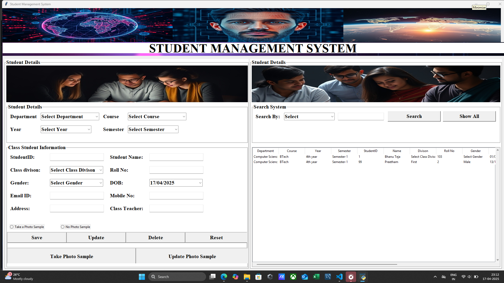

# Face Recognition Attendance System

An advanced attendance management system using facial recognition technology, built with Python, OpenCV, and tkinter.


## 🚀 Features

- **Face Detection & Recognition**
  - Real-time face detection using Haarcascade
  - LBPH (Local Binary Patterns Histograms) for face recognition
  - High accuracy with confidence threshold optimization


- **Attendance Management**
  - Automatic attendance marking
  - Dual storage: MySQL database & CSV export
  - Time and date stamping
  - Duplicate entry prevention



- **User-Friendly Interface**
  - Modern GUI built with tkinter
  - Student management system
  - Attendance record viewer
  - Easy navigation

- **Security**
  - Login system with authentication
  - Encrypted database connections
  - Secure attendance records

## 🛠️ Installation

1. **Clone the repository**
   ```bash
   git clone https://github.com/bhanuteja-tech/face-recognition-attendance-system.git
   cd face-recognition-attendance-system
   ```

2. **Create and activate virtual environment**
   ```bash
   python -m venv venv
   
   # Windows
   venv\Scripts\activate
   
   # Linux/macOS
   source venv/bin/activate
   ```

3. **Install dependencies**
   ```bash
   pip install -r requirements.txt
   ```

4. **Database Setup**
   ```bash
   # Create MySQL database
   mysql -u root -p
   CREATE DATABASE facialrecognition;
   
   # Run database setup script
   python create_attendance_table.py
   ```

5. **Configure environment**
   ```bash
   # Create .env file with your database credentials
   DB_HOST=localhost
   DB_USER=root
   DB_PASSWORD=your_password
   DB_NAME=facialrecognition
   ```

## 🏃‍♂️ Running the Application

1. **Start the application**
   ```bash
   python run.py
   ```

2. **First-time setup**
   - Login with default credentials
   - Add student details
   - Capture face data
   - Train the recognition model

## 📚 Usage Guide

1. **Student Registration**
   - Navigate to Student Management
   - Enter student details
   - Capture facial data
   - Save to database

2. **Training the System**
   - Go to Train Data section
   - Click "Train Data"
   - Wait for training completion

3. **Taking Attendance**
   - Select Face Recognition
   - System automatically detects faces
   - Marks attendance in real-time
   - Exports to CSV and database

4. **Viewing Records**
   - Access Attendance Records
   - Filter by date/student
   - Export reports as needed

## 🔧 System Requirements

- Python 3.8+
- MySQL Server
- Webcam/Camera device
- Minimum 4GB RAM
- 64-bit Operating System

## 🤝 Contributing

1. Fork the repository
2. Create feature branch (`git checkout -b feature/AmazingFeature`)
3. Commit changes (`git commit -m 'Add AmazingFeature'`)
4. Push to branch (`git push origin feature/AmazingFeature`)
5. Open Pull Request

## 📝 Project Structure

```
face-recognition-attendance/
├── images/                  # Image assets
├── data/                   # Training data
├── attendance.csv          # Attendance records
├── main.py                # Main application
├── face_recognition.py    # Recognition module
├── student.py            # Student management
├── attendance.py         # Attendance handling
├── developer.py         # Developer info
├── help.py             # Help documentation
└── requirements.txt    # Dependencies
```


## 📄 License

This project is licensed under the MIT License - see the [LICENSE](LICENSE) file for details.

## 🙏 Acknowledgments

- OpenCV community
- Face Recognition library developers
- tkinter documentation
- MySQL team

## 📞 Support

For support, email bhanutejasubbara@gmail.com or open an issue in the repository.

---
Made with ❤️ by Bhanu Teja.S 